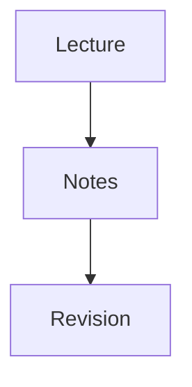

# Mermaid diagrams in the notes editor

Research and implementation date: 27 September 2026. The recommended integration is now implemented using Mermaid 12.0.0.

## Recommendation

Add the official `mermaid` package and extend the existing Tiptap `codeBlock` with a React node view. When its language is `mermaid`, show a diagram with an explicit **Edit code** control and a live preview during editing. Keep the Mermaid source as ordinary text inside the code block and save it as a standard Mermaid Markdown fence.

This fits the current editor, its Markdown file format, its undo history, and its nested study cards. It also avoids adding another editor framework or changing the notes format. The recommendation is an engineering judgment based on the repository inspection and the primary sources below.

## What the app already provides

The project declares React 19.2.8, Tiptap 3.31.3, `@tiptap/markdown`, Vite, and Tauri. Mermaid 12.0.0 and the matching Tiptap code-block package are now declared dependencies.

| Existing file                                             | Implication for the implementation                                                                                                                                                              |
| --------------------------------------------------------- | ----------------------------------------------------------------------------------------------------------------------------------------------------------------------------------------------- |
| `src/features/documents/lib/markdown.ts`                  | `noteExtensions()` registers StarterKit, including its code block, and the app's Markdown preservation rules. Replace the stock code block here while retaining its name and Markdown behavior. |
| `src/features/documents/components/StudyEditor.tsx`       | Opens Markdown directly and autosaves `getMarkdown()`. Its explicit paste handler currently handles images. Add Mermaid paste recognition without interfering with that path.                   |
| `src/features/documents/components/NoteVisual.ts`         | Already uses `ReactNodeViewRenderer` for custom blocks. Follow that established integration pattern.                                                                                            |
| `src/features/documents/components/NoteInsertPanel.tsx`   | Already inserts a code block and a following paragraph. Add a Mermaid diagram choice with starter code.                                                                                         |
| `src/features/documents/lib/blockTypes.ts`                | Supplies the slash commands. Add `/mermaid` and `/diagram` search terms.                                                                                                                        |
| `src/features/documents/lib/noteVisuals.ts`               | Study cards explicitly allow `codeBlock` children. Keeping this node type makes Mermaid eligible without changing that content rule.                                                            |
| `src/features/documents/components/NoteVisualPreview.tsx` | Uses a separate Markdown-to-React renderer, currently displaying every code block as text. It needs a Mermaid branch as well.                                                                   |
| `src/features/documents/components/NotebookView.tsx`      | Measures pages after editor changes, image loads, and fonts loading. An asynchronously rendered SVG needs an additional layout notification.                                                    |
| `src/features/documents/components/NotebookPage.tsx`      | Clones the live editor for turning pages and thumbnails. Test SVG references in those clones.                                                                                                   |
| `src-tauri/tauri.conf.json`                               | Production policy allows local scripts and inline styles but restricts remote connections. Bundle the renderer locally and check the actual production WebView.                                 |

I ran an in-memory probe using the installed Tiptap Markdown manager and code-block extension. It parsed the example below into `codeBlock` with `attrs.language === 'mermaid'` and serialized it back exactly, including indentation. This verifies the basic storage path; it does not verify the full app or SVG rendering.

````markdown

````

GitHub documents this Mermaid fence format, so notes would remain readable as diagram source and render in compatible Markdown viewers. Renderer versions can differ across applications. [GitHub diagram documentation](https://docs.github.com/en/get-started/writing-on-github/working-with-advanced-formatting/creating-diagrams).

## Options found on GitHub and in official documentation

| Option                                    | Evidence                                                                                                                                                                                        | Assessment for Uni Pilot                                                                                                                                                                                                           |
| ----------------------------------------- | ----------------------------------------------------------------------------------------------------------------------------------------------------------------------------------------------- | ---------------------------------------------------------------------------------------------------------------------------------------------------------------------------------------------------------------------------------- |
| Official Mermaid plus our own Tiptap view | Mermaid accepts diagram text and returns SVG. Tiptap documents React node views.                                                                                                                | Recommended. We control editing, persistence, and integration with the notebook.                                                                                                                                                   |
| `md2docx/tiptap-extension-mermaid`        | Its README describes extending `CodeBlockLowlight`, debounced previews, error handling, and a `prosemirror-mermaid` dependency. It identifies an MPL-2.0 license and claims Tiptap v2+ support. | A candidate for a spike and a useful reference. Tiptap 3.31.3 compatibility, actual peer dependencies, and our Markdown behavior were not verified. It also introduces syntax-highlighting infrastructure we do not currently use. |
| `md2docx/prosemirror-mermaid`             | Its README describes widget decorations, caching, and debounced rendering, under MPL-2.0.                                                                                                       | Useful for studying a decoration-based approach. It still leaves app-specific insertion, paste, previews, and notebook integration to us.                                                                                          |
| Official `mermaid-js/mermaid-live-editor` | Its rendering utility calls `initialize`, asynchronous `render`, and `parse`.                                                                                                                   | A reference for the rendering API and an editing/preview experience. Its full application is unnecessary for an inline note block.                                                                                                 |

Sources: [Mermaid API usage](https://mermaid.js.org/config/usage.html#api-usage), [Tiptap React node views](https://tiptap.dev/docs/editor/extensions/custom-extensions/node-views/react), [Tiptap Mermaid extension](https://github.com/md2docx/tiptap-extension-mermaid), [ProseMirror Mermaid plugin](https://github.com/md2docx/prosemirror-mermaid), and [official live-editor rendering utility](https://github.com/mermaid-js/mermaid-live-editor/blob/develop/src/lib/util/mermaid.ts).

The official Mermaid project uses the MIT license. Include its notice and review the installed dependency licenses in the app's existing attribution process. [Mermaid license](https://github.com/mermaid-js/mermaid/blob/develop/LICENSE).

## User experience

1. Choose **Insert → Mermaid diagram** or `/mermaid`. The block opens with a small working example, editable code, and its preview.
2. Type or paste raw Mermaid code into that block. Refresh the preview about 300 ms after typing pauses.
3. Choose **Done** to collapse the code and leave the diagram in the note. **Edit code** reopens the source.
4. Pasting a complete Mermaid fenced block into normal note text creates a diagram block. Pasting prose containing Mermaid fences can use the Markdown parser while retaining the surrounding prose.
5. Offer **Copy code**. Diagram export, zoom, and syntax highlighting can follow the initial feature.

Raw, unfenced code is unambiguous inside a Mermaid block. In ordinary prose, use an explicit diagram insertion/conversion action instead of broadly guessing that pasted text is a diagram. Empty or invalid code should remain editable and saveable. Keep the last successful preview, visibly mark it as out of date, and show a readable error.

## Implementation outline

**Storage and editor view.** Add an extension such as `NoteCodeBlock` based on `@tiptap/extension-code-block`, retaining `name: 'codeBlock'`, its `language` attribute, and its inherited Markdown handlers. Disable StarterKit's code block to avoid registering it twice. Declare the code-block package directly at the matching Tiptap version instead of relying on its current transitive installation. Use `ReactNodeViewRenderer` and retain a ProseMirror-managed `NodeViewContent` for editing. Ordinary code languages continue through a simple code view. The view's controls and SVG preview sit outside editable content. [Tiptap code-block documentation](https://tiptap.dev/docs/editor/extensions/nodes/code-block), [React node views](https://tiptap.dev/docs/editor/extensions/custom-extensions/node-views/react).

Store code as node text rather than a `code` attribute or separate component-only draft. Text edits then use the editor's existing transactions, undo, search, and autosave. Keep SVG, render status, and the code/preview toggle out of persisted document data. Preview refreshes must not create document updates or undo entries.

**Rendering service.** Lazy-load `import('mermaid')` when a diagram is needed. Use `startOnLoad: false` and call `await mermaid.render(uniqueId, source)` for the specific block. Catch failures locally. A request revision should discard obsolete results after further edits or unmounting. Use unique IDs for every mounted diagram, including read-only previews; a cache must not insert identical SVG IDs into multiple live instances. [Mermaid usage documentation](https://mermaid.js.org/config/usage.html).

Centralize configuration and scheduling because Mermaid exposes shared configuration. If rendering different themes requires reinitialization, serialize the initialize/render pair. Cache by source, effective configuration, and renderer version, with a bounded cache. Wait for the chosen local font before measuring the first diagram. Avoid rerendering diagrams on unrelated note edits.

**Pasting.** Recognize complete Mermaid fences outside existing code blocks and insert parsed Markdown with `contentType: 'markdown'`. Inside an existing Mermaid block, paste raw text; optionally unwrap a single enclosing Mermaid fence. Preserve HTML clipboard code-block semantics and the existing image handler. Support multiline indentation and Windows line endings, and enforce the editor's read-only state. Loading Markdown from a file and pasting Markdown are separate paths; the successful parser probe does not establish automatic clipboard conversion. [Tiptap Markdown insertion documentation](https://tiptap.dev/docs/editor/markdown/getting-started/basic-usage).

**Preview and notebook integration.** Share the renderer with `NoteVisualPreview`. Recalculate notebook pagination and preview dimensions after an SVG appears or changes size. Keep reasonable size limits and scrolling for large diagrams, and test blocks near page boundaries. `PageClone` duplicates descendant IDs, so verify and, where needed, namespace SVG IDs and their internal references in clones. Prevent editing controls from appearing in reading thumbnails and print output.

**Local rendering and imported code.** Use `securityLevel: 'strict'`, keep Mermaid's secure configuration keys protected from diagram directives, set source/edge limits, and use `suppressErrorRendering: true` to display our own errors. Prefer text labels (`htmlLabels: false`) for the initial integration and protect that app setting if required. Retain the existing restrictions on remote assets and test pasted diagrams that contain links, HTML labels, or external image references. [Mermaid security levels](https://mermaid.js.org/config/usage.html#securitylevel), [configuration schema](https://mermaid.js.org/config/schema-docs/config.html).

## Verification before shipping

- Markdown: repeated save/reopen preserves Mermaid source, indentation, comments, special characters, empty blocks, invalid syntax, and surrounding prose. Existing non-Mermaid code blocks and nested cards still round-trip. Longer or alternative fences need explicit coverage because serialization may normalize fences.
- Editing: insertion, code editing, copy/paste, undo/redo, deletion, and continuing below the diagram work with a keyboard. Read-only notes can display diagrams without editing them.
- Rendering: flowcharts, sequence diagrams, and mind maps render; rapid typing cannot display stale results; two diagrams and multiple previews do not conflict.
- Layout: narrow cards, notebook pagination, turning-page clones, late rendering, light/dark appearance, and print/read-only views behave correctly.
- Desktop: packaged Tauri renders offline under production policy, fonts load locally, and malformed or oversized diagrams report errors without losing source.

The implementation uses `NoteCodeBlock` for Markdown, paste handling, and keyboard continuation; `NoteCodeBlockView` for editing controls; and `MermaidDiagram` with a queued, lazy-loaded local renderer for live and read-only previews. SVG IDs are unique across cached instances and notebook clones, including duplicate definition IDs emitted by the renderer. The desktop bundle includes Mermaid dependency notices.

Presentation uses a custom `base` theme with a flat `classic` look, 13 px locally bundled JetBrains Mono labels, thin connectors, and restrained blue, green, violet, and amber palettes. Mermaid 12 defaults to wider nodes and a shadowed look for several diagram types; the integration explicitly opts out of those defaults and preserves natural SVG dimensions. Diagrams sit directly on the note's paper. Editing controls appear on hover or keyboard focus, remain available on touch screens, and stay visible while editing. Wide pages can display source and preview side by side; smaller pages stack them. Authored Mermaid colours and styles are preserved. Print and notebook copies hide editing controls. [Mermaid theme configuration](https://mermaid.js.org/config/theming.html).

Automated coverage checks source preservation, invalid and empty diagrams, longer fences, nested cards, clipboard conversion, ordinary code clipboard behavior, slash insertion, undo/redo, stale renders, editing controls, read-only previews, and clone references. Browser verification covers flowcharts, sequence diagrams, mind maps, fenced-code editing, and notebook presentation. Diagrams also render in a production frontend preview with the desktop content security policy. The production frontend build passes. The packaged Tauri WebView still needs a release smoke test; no external rendering service is used.
